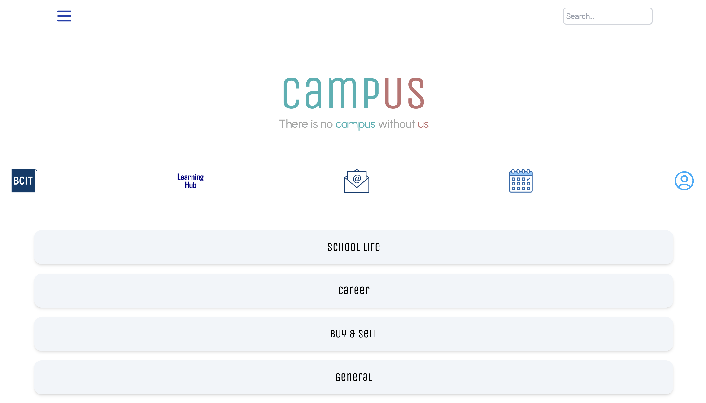
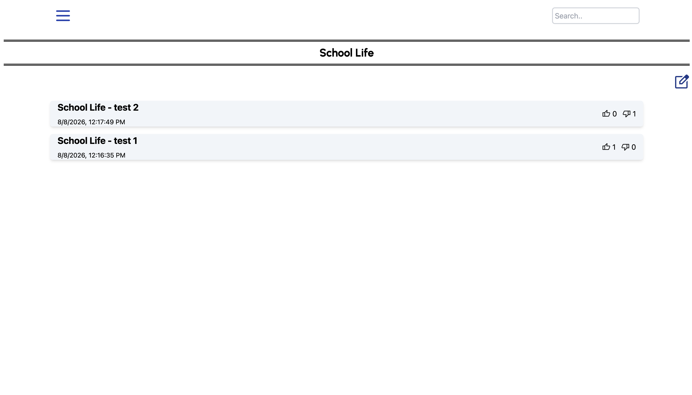
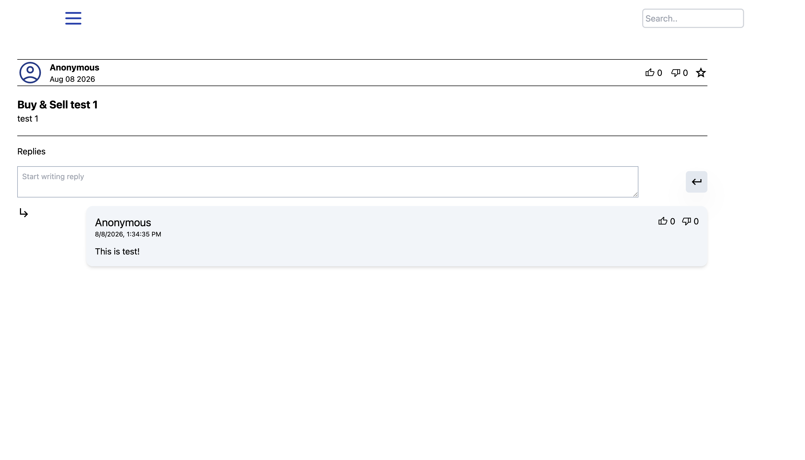
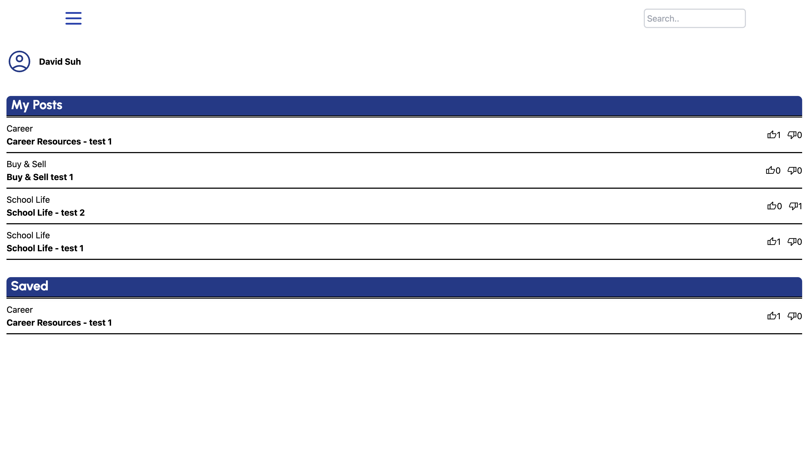

# BCIT-Hackathon-2024-Team8

## campUS

As a stressed-out student navigating the demanding workload at BCIT, I want an app that serves as a comprehensive solution to streamline my academic journey and alleviate stress. 

**"campUS"** is a one-stop-shop for essential resources and where you can communicate with your BCIT peers anonymously. How much laugh and support you can get out of "campUS" is completely up to you!



*The hub after sign-in — shortcuts to BCIT services and the four community boards.*

## Screens



*Each board lists its threads with timestamps and running like and dislike counts.*

---



*Threads open into the full post, a reply box, and every reply — all posted anonymously.*

---



*Your profile gathers the threads you wrote and the ones you starred.*

---

## Features

- **Email/password authentication** via FirebaseUI, with automatic user-profile
  creation on first sign-up
- **Four topic boards** — School Life, Career, Buy & Sell, General
- **Threads** with title, body, and author, posted from a single composer
- **Reactions** — thumbs up / thumbs down, stored per user so each account votes once
- **Replies** on every thread
- **Favorites** — star a thread and find it again on your profile
- **Profile page** listing your saved threads and your own posts

## Tech stack

| Layer | Choice |
|---|---|
| Markup / styling | HTML5, Tailwind CSS (Play CDN), custom CSS |
| Scripting | Vanilla JS + jQuery 3.5.1 |
| Auth | Firebase Authentication 8.10.0 + FirebaseUI 4.8.1 |
| Database | Cloud Firestore |
| Build | None — static files, no bundler, no npm |

Deliberately dependency-free: every page is a plain `.html` file loading the
Firebase compat SDK from a CDN, so it runs from any static file server.

---

## Getting started

**Prerequisites** — a Google account and any static file server. The
[Live Server][ls] VS Code extension works well.

[ls]: https://marketplace.visualstudio.com/items?itemName=ritwickdey.LiveServer

**1. Clone**

```bash
git clone <your-fork-url>
cd campus
```

**2. Set up Firebase** — in the [console](https://console.firebase.google.com):
create a project, register a Web app, enable **Email/Password** under
Authentication, and create a **Cloud Firestore** database.

**3. Add your config** — create `scripts/firebaseAPI_hackathon.js` with the
values from your Web app. This file is git-ignored and is *not* in the
repository; without it the app hangs on a blank `Loading...` screen.

```javascript
const firebaseConfig = { /* paste the values from the Firebase console */ };

const app = firebase.initializeApp(firebaseConfig);
const db = firebase.firestore();
const storage = firebase.storage();
```

Copy only the config values — not the `import` statements the console shows.
Those are for the modular v9+ SDK; this project uses the v8 compat build.

**4. Run** — serve the project root and open `index.html`. Use
`http://localhost:5500` rather than `127.0.0.1`, which Firebase does not
authorize by default.

---

## Data model

```
users/{uid}
  ├─ name       string    from the auth provider's displayName
  ├─ email      string
  ├─ country    string    defaults to "Canada"
  ├─ school     string    defaults to "BCIT"
  └─ favorites/{threadId}     presence of the doc = favorited

threads/{threadId}
  ├─ author     string    uid of the poster
  ├─ title      string
  ├─ description string
  ├─ category   string    "School Life" | "Career" | "Buy & Sell" | "General"
  ├─ likes      array     uids that thumbed up
  ├─ dislikes   array     uids that thumbed down
  ├─ timestamp  timestamp serverTimestamp()
  └─ replies/{replyId}
       ├─ author    string
       ├─ content   string
       ├─ likes     array
       ├─ dislikes  array
       └─ timestamp timestamp
```

Board pages query `threads` filtered by `category`; there is no separate
collection per board.

---

## Project structure

```
├── index.html            landing page
├── login.html            FirebaseUI auth widget
├── main.html             hub / quick links after sign-in
├── schoolLife.html       ┐
├── career.html           │ board pages — same layout,
├── buysell.html          │ different category filter
├── general.html          ┘
├── makeboard.html        thread composer
├── eachThread.html       thread detail, replies, reactions
├── profile.html          saved threads and own posts
├── template.html         starting point for new pages
├── Components/
│   └── navbar.html       injected at runtime by skeleton.js
├── scripts/
│   ├── firebaseAPI_hackathon.js   git-ignored — you create this
│   ├── authentication.js          FirebaseUI config + new-user bootstrap
│   ├── skeleton.js                loads the navbar, watches auth state
│   ├── navbar.js                  navigation handlers
│   ├── makeboard.js               thread creation
│   ├── eachThread.js              detail view, replies, likes, favorites
│   ├── profile.js                 saved threads and own posts
│   └── schoolLife.js · career.js · buysell.js · general.js
├── styles/icons.css
└── images/
```

## Credits

Built at the BCIT Hackathon 2024 by **Team 8**. This fork is maintained by
[David(SungJin) Suh](https://github.com/SungJin-Suh) and runs on a separate Firebase project; none
of the original team's data is used.